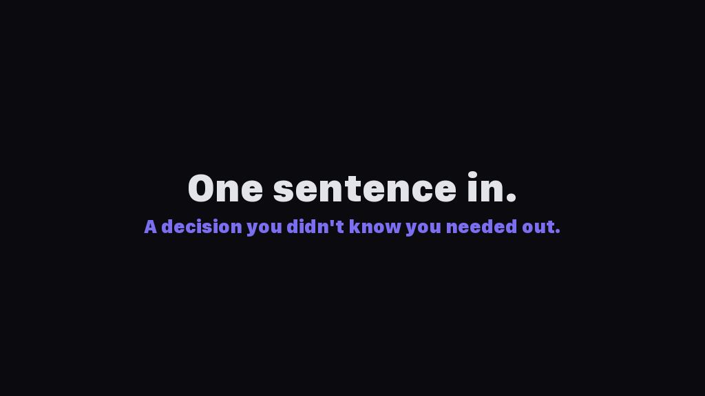

# Decision Kit

**Outsource the thinking. Keep the judgment.**

<p align="center"></p>

Here's the thing people get wrong about AI: they say "don't outsource the thinking." And yeah, that sounds right. You shouldn't outsource ALL the thinking. The critical thinking is still yours. The part where you look at a set of options and know which one is right because you've been living this problem for months and you understand things the AI never will. That part stays with you. That's the whole point.

But the other kind of thinking? The grunt work of exploring four pricing models, visualizing them, comparing them across six dimensions, pulling together context you'd otherwise spend a week assembling? AI can do that in two minutes. You can't. I can't. Nobody can. And there's no reason to pretend otherwise.

That's the separation that matters. AI does the work around the decision so you can do the part that actually requires you: looking at four options and saying "this one, because it fits who we are." That's judgment. And judgment is yours.

Decision Kit is a system that makes that separation clean. AI does all the work *around* the decision - the exploration, the options, the visual comparisons, the tradeoffs. Then it stops and waits for you to make the call. Every decision gets a beautiful visual page you can actually look at and compare. You pick. It remembers. The next decision builds on the last one.

```
/decide I wanna make a tool-sharing app for my neighborhood
```

You said one sentence. And then this shows up:

<p align="center"></p>

You didn't ask for this. You didn't design it. You didn't even know this was a decision you needed to make. The AI built this whole page out of nothing: the question, the four options, the visual previews, the tradeoffs, the comparison table, the recommendation. It read your one sentence, understood what you were actually trying to do, and surfaced the decision that makes or breaks the entire thing. "How do neighbors build trust?" Yeah. Obviously. How did you not think of that?

That keeps happening. You came in with an idea and Decision Kit pulls out the decisions hiding inside it, the ones you would have eventually stumbled into three weeks from now, except now they're in front of you with options you can actually see and compare.

You pick. It remembers. On to the next one. Go ahead, argue with the AI's recommendation. It's more fun that way.

When you're done thinking, you can hand the whole stack of decisions to an AI coding tool and tell it to build. The decisions become the spec. Every choice you made, every reason you gave, every tradeoff you weighed... it's all there, structured, ready to inform the code. You're not starting from a blank prompt. You're starting from a decision record. Want to skip the build? Feel free. Decision Kit is happy being just a thinking tool. But if you want the thinking to turn into code, the path is right there.

---

## Contents

- [The separation that matters](#the-separation-that-matters)
- [Start here in 2 minutes](#start-here-in-2-minutes)
- [How it works](#how-it-works)
- [The decision artifact](#the-decision-artifact)
- [Decisions compound](#decisions-compound)
- [Idea to code, at a glance](#idea-to-code-at-a-glance)
- [Greenfield and brownfield](#greenfield-and-brownfield)
- [Beyond software](#beyond-software)
- [How this compares](#how-this-compares)
- [Skills](#skills)
- [Install](#install)
- [Hooks](#hooks)
- [Build your own thinking skill](#build-your-own-thinking-skill)
- [Try it](#try-it-tell-us-what-happened)

---

## The separation that matters

**AI thinks. You judge. Things get built.**

That's the whole idea. When you structure it that way, when the roles are explicit and the handoff is clean, something kind of magical happens. You make decisions in minutes that used to take days. The decisions themselves get better because you can see them, compare them, and revisit them months later. And nothing gets lost.

This is Decision Driven Development. Software (and everything else) is built through decisions. Make those decisions structured, visual, and fast, and the building gets better. The output isn't slop because a human was in the loop at every point that mattered.

---

## Start here in 2 minutes

**1. Clone:**
```bash
git clone https://github.com/jnemargut/decision-kit.git
```

**2. Install:**
```bash
cp -r decision-kit/thinking/* ~/.skills/
cp -r decision-kit/action/* ~/.skills/
cp -r decision-kit/configuration/* ~/.skills/
cp -r decision-kit/orchestrator/* ~/.skills/
```

**3. Run:**
```
/decide my friend and I are thinking about launching a food truck
```

Don't know which skill to use? That's the whole point of `/decide`. Say what's on your mind and it figures out the rest.

Or go direct if you already know what you need:
```
/strategize thinking about opening a coffee shop downtown
```

A decision page pops open in your browser. Pick an option. Watch the next decision build on yours. Tell the AI its recommendation is wrong. Bring your own answer. Change your mind later. It's all part of the process.

---

## How it works

The system has two types of skills, and the boundary between them is everything.

<p align="center"></p>

**Thinking skills** do the thinking. They gather context, generate options, build comparisons, and recommend. Then they stop and wait for you to judge. They never execute anything. Their entire job is to make your judgment call as informed as possible, as fast as possible.

**Action skills** execute on your judgment. They read what you decided and produce deliverables: roadmaps, launch plans, briefs, code. They never make judgment calls. They just do what you already decided.

**The decision** is the gate between thinking and doing. Nothing moves forward until a human has judged.

---

## The decision artifact

Every decision produces a real, tangible artifact you can open in a browser. Not notes buried in a doc. Not a Slack message someone will scroll past. A beautiful, structured page that lays out exactly what was considered and what was chosen.

<p align="center"></p>

Each page includes:

- **Context** - what's being decided and why it matters
- **Options** - 4 visual options with rendered previews (UI mockups, flow diagrams, persona cards, revenue models, whatever makes the difference visible)
- **Tradeoffs** - honest pros and cons for every option

<p align="center"></p>

- **Comparison** - side-by-side across the dimensions that matter

<p align="center"></p>

- **Your choice** - what you decided
- **Your reasoning** - why you chose it (captured when you volunteer it, never nagged out of you)

Open `.decisions/index.html` six months from now. See exactly what was decided, when, and why. New team member? Point them at the folder. Argument about why something was built a certain way? The answer is right there. Decisions stop being ephemeral things that happened in someone's head and start being artifacts that persist and compound.

---

## Decisions compound

This is the part that surprised me the most. Each skill reads the previous skill's decisions. No re-asking. No lost context. It just builds.

### Any domain: Strategize, Game Plan, Brief
```
/strategize we're launching a food truck        # think through the strategy
/game-plan                                    # generate the operational roadmap
/brief                                        # generate a shareable summary
```

### Product development: Strategy, Plan, Design
```
/product-strategy A tool-sharing app                 # figure out what and why
/product-plan                                        # generate the launch playbook
/product-design the v1 tool-sharing app we planned   # design decisions based on both
```

### Engineering: Strategy, Design, Ticket, Code
```
/product-strategy A tool-sharing app              # figure out what and why
/product-design the v1 app we planned             # design decisions
/ticket-breakdown Add OAuth2 login (PROJ-1234)    # implementation decisions for this ticket
# ... write the code using the implementation brief ...
```

Your strategy informs your design. Your design informs your engineering. Context builds instead of resetting. You never start from zero. It's like compound interest, but for thinking.

---

## Idea to code, at a glance

All you need is one simple prompt. One idea. One sentence about a thing you want to exist. Decision Kit takes it from there, and by the time you're done, you've thought it through with AI as your partner, made every meaningful decision on purpose, and you're ready to build something great together.

Here's what a full run looks like, end to end. Every step writes decisions. Every next step reads them. By the time you're building, the AI already knows everything you decided and why.

```
You:        /decide I want to build a daily briefing app for my calendar
Decision Kit:  [routes to /product-strategy, this sounds like a product idea]
            [asks the real questions: who is this for? what problem?
            why does it beat just opening Google Calendar?]
            [surfaces 5 strategic decisions you didn't know you had]
            [you pick, you judge, you argue with the recommendations]
            [writes .decisions/strategy-brief.md]

You:        /product-design the app we just planned
Decision Kit:  [reads the strategy brief, doesn't re-ask who it's for]
            [walks through framework, data model, auth, UX flows, component design]
            [you decide: server components, Postgres, OAuth, card-based UI]
            [writes the design decisions to .decisions/]

You:        /ticket-breakdown
Decision Kit:  [reads every prior decision, knows your stack]
            [breaks the work into tickets, surfaces the implementation
            decisions for each: scope, approach, testing, PR plan, risks]
            [writes implementation-plan.md, a mini-spec]

You:        "Now build it" (to any AI coding tool: Claude, Cursor, Codex)
AI:         [reads .decisions/, your full decision record]
            [writes something great because every meaningful choice is
            already in there: who it's for, why it exists, how it should
            feel, what stack to use, how to test it]
```

You started with one sentence. You ended with working code. In between, you thought it through with AI as your partner and made every decision that mattered. Nobody skipped the thinking. Nobody rushed the judgment. Every choice is in `.decisions/`, every reason is captured, and a week from now you can open the folder and see exactly why the app looks the way it looks. You didn't just get code. You built something great, together.

---

## Greenfield and brownfield

Works whether you're dreaming something up or knee-deep in existing code.

### Greenfield (new ideas, exploration)

When you have an idea but no code yet, the danger isn't that you'll make bad decisions. It's that you'll skip them. You'll start building and assume you can figure it out as you go. Three weeks later you've made 40 decisions without realizing it, half of them contradict each other, and you can't remember why you chose any of them.

Greenfield mode is the antidote. You tell `/strategize`, `/shape`, `/product-strategy`, or `/product-design` what you're working on, and it surfaces the decisions you actually need to make before code gets in the way. Not every decision. The ones that matter. The ones that will haunt you if you skip them.

```
/strategize should we build a tool-sharing app for neighbors?
```

It identifies the decisions hiding in your idea. Who's this actually for? How do strangers learn to trust each other? What's the model that makes this not feel like an awkward favor? You see options for each one, you pick, you move on. Twenty minutes later you have a strategy brief that captures every choice and every reason. Now you can build, and every line of code traces back to a decision you made on purpose.

### Brownfield (existing code, no decisions recorded)

Here's something that took a minute to fully sink in: every line of code is a decision someone made. The framework you chose. The way you handle errors. Whether sessions live in cookies or JWTs. The fact that signups need email verification but password resets don't. None of those are written down anywhere. They're not in the docs. They're not in the commit messages. They're encoded in the code itself, and the code is the only place they exist.

Your codebase is a graveyard of decisions nobody can see anymore.

`/excavate` reads your code and digs them out.

```
/excavate
```

<p align="center"></p>

It scans in layers: configs and dependencies first, then architecture, then patterns like error handling and state management, then higher-level signals like UX patterns and business model decisions. You confirm, review, or reject findings. Every confirmed finding becomes a recorded decision. The invisible becomes browsable.

From there, `/journal` evolves those decisions over time:

```
/journal our target user ended up being suburban homeowners, not urban renters
```

<p align="center"></p>

Decisions mature: early sketch (no reasoning) becomes firmed up (has reasoning) becomes evolved (has reasoning + history of changes). You can look at any decision and immediately know how mature it is.

> **Bonus for coders:** lost your context window? No problem. Your context is embedded in your decisions. Start a fresh session, point the AI at `.decisions/`, and it picks up exactly where you left off. The reasoning is right there in the JSON. The tradeoffs are in the HTML. The history is in the journal. You don't re-explain yourself, you just keep going.

---

## Beyond software

Decision Driven Development started in software, but the pattern works anywhere decisions matter. Product strategy, UX design, business decisions, wedding planning, food truck launches, home renovations. The separation is always the same: AI thinks, you judge.

The examples in this repo include a [food truck launch](examples/food-truck/), a [neighborhood tool library](examples/community-app/), and [wedding planning](examples/wedding-planning/).

---

## How this compares

| | Decision Kit | Prompt Libraries | Agent Frameworks | Traditional Planning |
|---|---|---|---|---|
| **Decisions are** | Structured artifacts | Ephemeral chat | Implicit in code | Docs nobody reads |
| **Human judgment** | Required at every gate | Optional | Minimal | Upfront only |
| **Decisions compound** | Yes (each skill reads prior) | No | No | Manually |
| **Visual options** | Always | Never | Never | Sometimes |
| **Execution** | After decisions, not before | Immediate | Immediate | Separate process |
| **Tracks changes** | History + reasoning | No | Git only | Version hell |

---

## Skills

### `/decide` - The entry point to everything

Don't know which skill to use? Don't care. Just say what's on your mind. The orchestrator reads your intent, picks the right skill, and takes you there.

```
/decide help me figure out this sleep app idea
```

### Thinking Skills

These do the thinking for you. Context gathering, option generation, visual comparisons, tradeoff analysis. Then they stop and wait for your judgment.

| Skill | What it does | When to use it |
|-------|-------------|----------------|
| `/strategize` | Strategy for any complex situation | You have a goal and need to figure out the right approach |
| `/shape` | Design and implementation planning | You know *what*, now figure out *how* |
| `/product-strategy` | Product "what and why" - problem, users, positioning, business model | You're about to build a product |
| `/product-design` | Product "how" - framework, database, visual direction, UX flows | You know what to build, now make the tech and design calls |
| `/ticket-breakdown` | Ticket to implementation plan - scope, approach, testing, PR plan | You have a ticket and want to think before coding |
| `/self-code-review` | Review your own code before the PR | You've written code and want to catch issues before a teammate sees it |
| `/excavate` | Surface decisions hidden in an existing codebase | You inherited a project or want to audit what's already decided |
| `/journal` | Record and track decisions you've already made | You're past exploration and want to document what you know |
| `/state-your-case` | Decision circuit breaker during AI implementation | You want AI to build but flag judgment calls for you |
| `/core-principles` | Derive "X over Y" tension-based principles | You want to articulate the beliefs guiding your strategy |

### Action Skills

These execute on your judgment. They read what you decided and produce deliverables. No questions asked.

| Skill | What it does | When to use it |
|-------|-------------|----------------|
| `/game-plan` | Phased operational roadmap with tasks | After any thinking skill - you need a concrete plan |
| `/product-plan` | Launch playbook - operations, partnerships, go-to-market | After `/product-strategy` - everything beyond writing code |
| `/brief` | Shareable one-page HTML summary | You want to send someone a clean summary of what was decided |
| `/challenge` | Gently challenge your decisions - contradictions, gaps, stale choices | You want a sanity check before a big milestone |

### Configuration Skills

These shape how thinking skills behave. Run them first.

| Skill | What it does |
|-------|-------------|
| `/whoiam` | Tell the system who you are so decisions are framed in your language |
| `/research-sources` | Configure which sources you trust for context gathering |
| `/hook-init` | Connect decisions to an external service for sync and privacy controls |

---

> **Want more detail on any skill?** Expand the section below for full descriptions with code examples, usage flows, and what each skill checks or produces.

<details>
<summary><h3>Full skill details (click to expand)</h3></summary>

---

#### `/strategize` - Strategy for anything

The general-purpose thinking skill. Works for any complex situation: product strategy, business launches, life decisions, anything with real stakes.

```
/strategize my partner and I are launching a food truck
```
It identifies the 4-7 decisions that matter most, gathers context for each one, and presents visual options. You judge. It stores your decisions and generates a strategy brief.

**Example decisions it might present:** Target market, pricing strategy, location model, brand identity, competitive positioning.

---

#### `/shape` - Design and implementation planning for anything

Takes a goal or strategy and walks through the detailed implementation decisions: architecture, visual design, user flows, information structure.

```
/shape how should we structure our community workshop series?
```
Reads any prior strategy decisions, then presents implementation choices with visual previews, layouts, flow diagrams, structural options.

---

#### `/product-strategy` - The "what and why" for products

Validates the idea before you build. Problem definition, target users, market positioning, business model, and success metrics.

```
/product-strategy A tool-sharing app for neighbors
```
Gathers context about the market and landscape, then walks you through the strategic decisions that define what the product is and why it matters.

---

#### `/product-design` - The "how" for products

Technical and UX decisions. Frontend framework, database, visual direction, navigation patterns, user flows, component design.

```
/product-design the v1 tool-sharing app we planned
```
If you've run `/product-strategy` first, it reads your strategy brief and uses it to inform every design option. It won't re-ask who your users are. It already knows.

---

#### `/ticket-breakdown` - From ticket to implementation plan

Takes a ticket (or any task description), reads the codebase for context, and surfaces the implementation decisions: scope, approach, testing strategy, PR plan, and risks.

```
/ticket-breakdown Add OAuth2 login with Google and GitHub providers.
Should work with our existing user table. Mobile web needs to work.
```
Reads the project, finds your tech stack, existing patterns, relevant files, then presents implementation decisions grounded in YOUR codebase.

**The Adaptive Five decisions:**
- **Scope & Boundaries** - what's in, what's out, what's ambiguous
- **Approach** - how to build it, which patterns, which files
- **Testing Strategy** - what to test, what kind, edge cases
- **PR Plan** - one PR or stacked, what order, smallest shippable piece
- **Risks & Gotchas** - what could break, dependencies, rollback

---

#### `/self-code-review` - Review your own code before the PR

Reads the diff, the codebase, and any prior implementation decisions, then surfaces what you should be thinking about before opening the PR.

```
/self-code-review
```
Or focus it:
```
/self-code-review just the auth changes
```
Produces visual assessment pages for each dimension, each rated green, amber, or red.

**What it checks:** Scope Drift, Architecture Fit, Testing Adequacy, Complexity & Readability, PR Readiness.

**The engineering flow:**
```
/ticket-breakdown PROJ-1234           # decide how to implement
# ... write the code ...
/self-code-review                     # check your work
# ... open the PR for peer review ...
```

---

#### `/excavate` - Codebase decision archaeology

Reads your code and surfaces the decisions nobody wrote down: framework choices, auth patterns, error handling philosophy, UX decisions, even business model signals.

```
/excavate
```
Scans in 4 layers: surface (configs, dependencies), structural (routes, models, middleware), patterns (error handling, testing, state management), and meaning (UX decisions, business model signals). Re-run after changes and it only shows what's new or what drifted.

---

#### `/journal` - Decision journal for brownfield

You bring the answers, AI visualizes and records them. For when you already know things and want to document decisions with reasoning and change tracking.

```
/journal our target user ended up being suburban homeowners, not urban renters
```
AI generates a full visual decision page even though you already know the answer. If this changes a prior decision, it asks one reflection question, then stores both the old and new decision with your reasoning.

---

#### `/state-your-case` - Decision circuit breaker during implementation

Runs WHILE AI is building. When AI encounters a judgment call (something that contradicts a prior decision, needs human input, or is too important to decide silently) it stops, presents options, and waits.

```
/state-your-case build the OAuth login flow from the implementation brief
```
AI builds. When it hits something that needs judgment, it pauses, generates a decision page explaining WHY it stopped, and waits for you to judge. Then continues.

---

#### `/core-principles` - Derive tension-based principles

Surfaces real tensions in your idea, where user needs, business needs, and doing right by the world pull in different directions, and helps you take a stance. Produces principles in "X over Y" format.

```
/core-principles a neighborhood tool-sharing app
```

---

#### `/game-plan` - Operational roadmap from any strategy

Takes your decisions and generates a phased operational roadmap with specific tasks, timelines, and priorities.

```
/strategize thinking about launching a food truck
# ... make your decisions ...
/game-plan
```

---

#### `/product-plan` - Launch playbook for products

Launch roadmap: operations, partnerships, trust-building, supply acquisition, go-to-market execution. Everything beyond writing code.

```
/product-strategy A tool-sharing app for neighbors
# ... make your strategy decisions ...
/product-plan
```

---

#### `/brief` - Shareable one-pager from any decisions

Generates a polished, self-contained HTML one-pager you can share with anyone.

```
/brief
```

---

#### `/challenge` - Hold up a mirror to your decisions

Reads all your decisions and gently challenges them. Surfaces contradictions, flags missing reasoning, identifies untested assumptions, highlights stale decisions.

```
/challenge
```
Or focus it:
```
/challenge are there contradictions with our pricing model?
```

---

#### `/whoiam` - Tell the system who you are

Takes 15 seconds. You tell it your role and how familiar you are with the topic. It saves a profile that adapts language, analogies, and comparison dimensions across every thinking skill.

```
/whoiam I'm a teacher looking into investing for retirement
```

---

#### `/research-sources` - Configure your source trust

5 quick decisions about where information comes from: domain, source types, trusted voices, domain allowlist/blocklist, recency.

```
/research-sources I'm exploring how to price a SaaS product
```

---

#### `/hook-init` - Connect decisions to an external service

Walks through provider selection, project identity, visibility defaults, auto-sync preferences, and credentials. Installs hook scripts from the provider's hook package.

```
/hook-init
```

</details>

---

## Install

```bash
git clone https://github.com/jnemargut/decision-kit.git
```

**Install everything:**
```bash
cp -r decision-kit/thinking/* ~/.skills/
cp -r decision-kit/action/* ~/.skills/
cp -r decision-kit/configuration/* ~/.skills/
cp -r decision-kit/orchestrator/* ~/.skills/
```

**Or install just the skills you want:**
```bash
# The orchestrator (just say what's on your mind)
cp -r decision-kit/orchestrator/decide ~/.skills/

# Just the general-purpose thinking skill
cp -r decision-kit/thinking/strategize ~/.skills/

# Just the product pipeline
cp -r decision-kit/thinking/product-strategy ~/.skills/
cp -r decision-kit/thinking/product-design ~/.skills/
cp -r decision-kit/action/product-plan ~/.skills/

# Configuration skills
cp -r decision-kit/configuration/whoiam ~/.skills/
cp -r decision-kit/configuration/research-sources ~/.skills/
cp -r decision-kit/configuration/hook-init ~/.skills/
```

Copy skills to wherever your AI coding tool reads SKILL.md files from (e.g., `~/.skills/`, `~/.claude/skills/`, `~/.cursor/skills/`). Works with any tool that supports the SKILL.md format.

---

## Hooks

> **Early-stage.** The hooks spec and `/hook-init` skill are designed but largely untested against live providers. The architecture is solid, the contracts are defined, and there are working examples, but no one has battle-tested this in production yet. Expect rough edges. Contributions welcome.

Decisions don't have to stay on your machine. Hooks let you sync decisions to external tools (issue trackers, chat platforms, dashboards, anything) with privacy controls and project bundling.

**What it enables:**
- **Sync** - decisions push to your provider automatically or on demand
- **Privacy** - all public, all private, or per-decision visibility (private by default)
- **Project bundling** - group decisions from multiple repos into one project on the provider
- **Auto-sync** - toggle real-time sync or accumulate locally and push when ready

**How it works:** Run `/hook-init` to connect a provider. The skill walks you through setup, installs hook scripts, and configures credentials. After that, your thinking skills sync decisions as you make them, or you say "push my decisions" when you're ready.

Cloud providers ship **hook packages**, just a manifest and a few shell scripts. No CLI to build, no installer to maintain. See [docs/building-a-provider.md](docs/building-a-provider.md) for the full guide with working examples.

For the full spec: [SPEC.md - Hooks](SPEC.md#hooks).

---

## Build your own thinking skill

The spec is open. If your skill does the thinking and waits for the human to judge, it's a thinking skill, and it composes with every other one.

1. Read [SPEC.md](SPEC.md) for the three rules
2. Read [docs/building-a-thinking-skill.md](docs/building-a-thinking-skill.md) for the step-by-step guide
3. Follow the pattern: do the thinking, show the options, wait for the judgment, remember the choice

---

## Try it. Tell us what happened.

Install a skill, run it on your next idea, and tell us what surprised you.

- Open an issue with your experience
- Share a screenshot of your favorite decision page
- Or build your own thinking skill and share it

The best part is finding out you had opinions you didn't know about until someone laid out the options.
